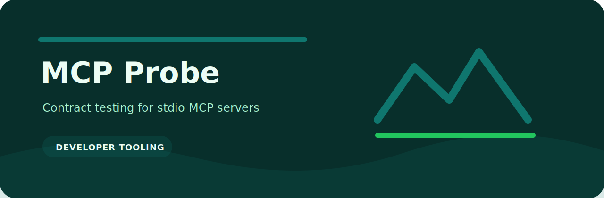

<p align="center">
  
</p>

# MCP Probe

   

Contract testing for stdio MCP servers.

## Good for

- quick local checks around developer tooling
- small CI jobs where a readable report is enough
- review workflows that need deterministic output
- examples based on `examples/demo.json`

## Run it

```bash
python -m pip install -e ".[dev]"
mcp-probe examples/demo.json
```

## Project notes

- Command: `mcp-probe`
- Language: Python
- Python: `>=3.11`
- Tests: `pytest`

## Layout

```text
.github/        CI workflow
examples/       sample inputs
src/            package source
tests/          test coverage
.gitignore      project file
pyproject.toml  package metadata
```

## Check locally

```bash
python -m pip install -e ".[dev]"
ruff check .
pytest
python -m mcp_probe --help
```
