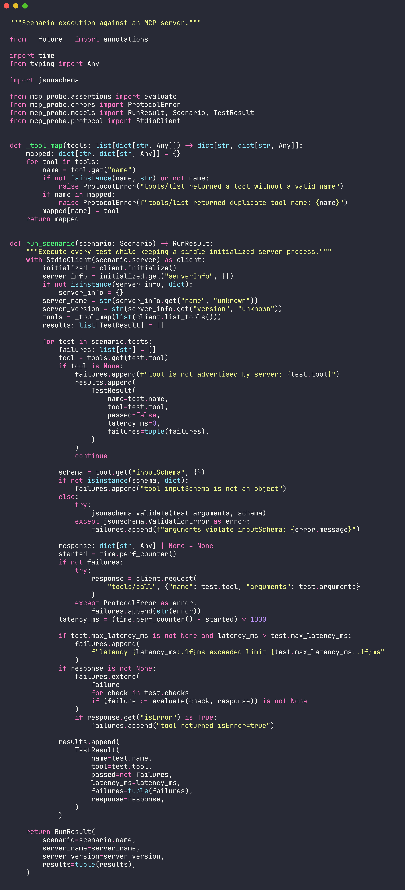
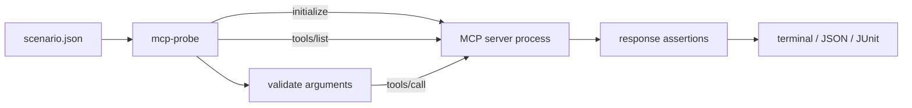

# mcp-probe

`mcp-probe` turns MCP tool behavior into repeatable contract tests. Point it at
any newline-delimited JSON-RPC server over stdio, describe the expected calls in
one JSON file, and run the same checks locally or in CI.

It is designed for a practical failure mode in agent systems: a tool still
starts, but its schema, response shape, error behavior, or latency silently
changes.



```text
mcp-probe · demo MCP contract
server: demo-server 1.0.0

PASS  slugifies a phrase  0.1ms

1 passed, 0 failed, 1 total
```

## What it checks

- MCP initialization and stdio JSON-RPC communication
- advertised tool names and input schemas
- test arguments against each tool's JSON Schema before execution
- nested response values with `equals`, `contains`, `matches`, and `exists`
- per-call latency budgets
- MCP tool errors through `isError`
- JSON and JUnit XML reports for CI systems
- environment placeholders without storing secrets in scenario files

The CLI has no dependency on a specific MCP SDK, so it can test servers written
in Python, TypeScript, Go, or any other language.

## Install

Requires Python 3.11 or newer.

```bash
git clone https://github.com/mertefekurt/mcp-probe.git
cd mcp-probe
python -m venv .venv
source .venv/bin/activate
python -m pip install -e .
```

For development tools:

```bash
python -m pip install -e ".[dev]"
```

## Define a contract

```json
{
  "name": "search server smoke tests",
  "server": {
    "command": ["python", "-m", "my_mcp_server"],
    "env": {
      "SEARCH_API_KEY": "${SEARCH_API_KEY}"
    },
    "timeout_seconds": 5
  },
  "tests": [
    {
      "name": "returns a ranked result",
      "tool": "search",
      "arguments": {"query": "model context protocol"},
      "checks": [
        {
          "path": "structuredContent.results.0.title",
          "operator": "contains",
          "expected": "Model Context Protocol"
        },
        {
          "path": "isError",
          "operator": "exists",
          "expected": false
        }
      ],
      "max_latency_ms": 1500
    }
  ]
}
```

Paths use dot-separated object keys and numeric list indexes. `contains` works
with strings, arrays, and object keys. `matches` accepts a regular expression.

## Run

```bash
mcp-probe contracts/search.json
```

Generate CI artifacts while preserving the normal terminal summary:

```bash
mcp-probe contracts/search.json \
  --json-report reports/probe.json \
  --junit-report reports/probe.xml
```

Exit codes are intentionally script-friendly:

| Code | Meaning |
| ---: | --- |
| `0` | every contract passed |
| `1` | one or more contracts failed |
| `2` | configuration, startup, or protocol failure |

The repository includes a self-contained server and scenario:

```bash
mcp-probe examples/demo.json --no-color
```

## Execution model



One server process is initialized per scenario. Tool metadata is collected once,
then tests run sequentially so stateful servers can be tested predictably.
Scenario-level process isolation prevents one server from leaking state into
another run.

## Project layout

```text
src/mcp_probe/
├── assertions.py   response path resolution and checks
├── cli.py          command-line interface and exit codes
├── config.py       scenario parsing and environment expansion
├── protocol.py     stdio JSON-RPC process client
├── reporters.py    terminal, JSON, and JUnit output
└── runner.py       MCP discovery, schema validation, and execution
```

## Tests and quality checks

The test suite covers configuration failures, environment expansion, nested
assertions, a real stdio subprocess, JSON Schema validation, and report output.

```bash
ruff check .
ruff format --check .
pytest
```

GitHub Actions runs the checks and the example contract on Python 3.11 and 3.12.

## Scope

`mcp-probe` currently targets stdio servers that use one JSON-RPC message per
line. It intentionally does not launch remote HTTP transports or judge natural
language quality; its job is deterministic protocol and tool-contract testing.

## License

[MIT](LICENSE)
