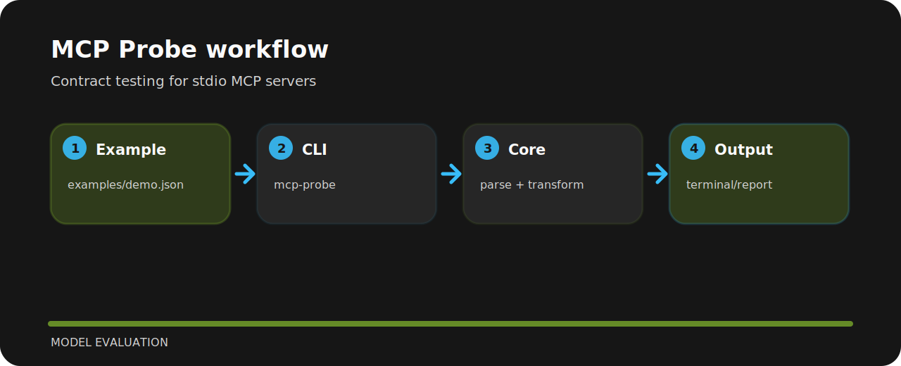

# MCP Probe

Contract testing for stdio MCP servers. The repo is kept small on purpose: clone it, run the sample, inspect the output, then adapt the idea.


## Open these first

```text
.github/        CI workflow
examples/       sample inputs
src/            package source
tests/          test coverage
.gitignore      project file
```

## Run it

```bash
git clone https://github.com/mertefekurt/mcp-probe.git
cd mcp-probe
python -m pip install -e ".[dev]"
mcp-probe examples/demo.json
```

## Shape of the tool


